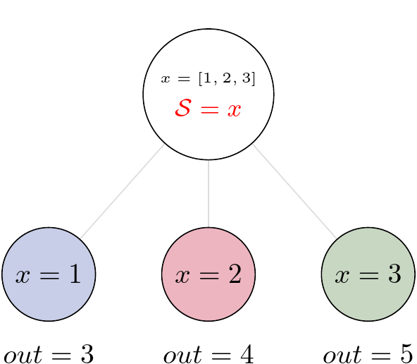

State and Nested Loops over Input
=================================

One of the main goals of creating Pydra was to support flexible evaluation of a Task or a Workflow
over combinations of input parameters.
This is the key feature that distinguishes it from most other dataflow engines.
This is similar to the concept of the Map-Reduce_, but extends it to work over arbitrary nested graphs.
In complex dataflows, this would typically involve significant overhead for data management
and use of multiple nested loops.
In Pydra, this is controlled by setting specific State related attributes through Task methods.
In order to set input splitting (or mapping), Pydra requires setting up a splitter.
This is done using Task's split method.
The simplest example would be a Task that has one field x in the input, and therefore there
is only one way of splitting its input.
Assuming that the user provides a list as a value of x, Pydra splits the list, so each copy
of the Task will get one element of the list.
This can be represented as follow:

.. math::

   S = x: x=[x_1, x_2, ..., x_n] \longmapsto x=x_1, x=x_2, ..., x=x_n~,

where S represents the splitter, and x is the input field.
This is also represented in the diagram, where :math:`x=[1, 2, 3]` as an example, and the coloured
nodes represent stateless copies of the original Task after splitting the input,
(these are the runnables that are executed).

Types of Splitter
-----------------
Whenever a *Task* has more complicated inputs,
i.e. multiple fields, there are two ways of creating the mapping,
each one is used for different application.
These *splitters* are called *scalar splitter* and *outer splitter*.
They use a special, but Python-based syntax as described next.

Scalar Splitter
---------------
A *scalar splitter* performs element-wise mapping and requires that the lists of
values for two or more fields to have the same length. The *scalar splitter* uses
Python tuples and its operation is therefore represented by a parenthesis, ``()``:

.. math::

  S = (x, y) : x=[x_1, x_2, .., x_n],~y=[y_1, y_2, .., y_n] \mapsto (x, y)=(x_1, y_1),..., (x, y)=(x_n, y_n),

where `S` represents the *splitter*, `x` and `y` are the input fields.
This is also represented as a diagram:

.. figure:: images/nd_spl_4.png
   :figclass: h!
   :scale: 80%

Outer Splitter
--------------

The second option of mapping the input, when there are multiple fields, is
provided by the *outer splitter*. The *outer splitter* creates all combination
of the input values and does not require the lists to have the same lengths.
The *outer splitter* uses Python's list syntax and is represented by square
brackets, ``[]``:

.. math::

   S = [x, y] &:& x=[x_1, x_2, ..., x_n],~~ y=[y_1, y_2, ..., y_m], \\
   &\mapsto& (x, y)=(x_1, y_1), (x, y)=(x_1, y_2)..., (x, y)=(x_n, y_m).

The *outer splitter* for a node with two input fields is schematically represented in the diagram:

.. figure:: images/nd_spl_3.png
   :figclass: h!
   :scale: 80%

Different types of splitters can be combined over inputs such as
`[inp1, (inp2, inp3)]`. In this example an *outer splitter* provides all
combinations of values of `inp1` with pairwise combinations of values of `inp2`
and `inp3`. This can be extended to arbitrary complexity.
In additional, the output can be merge at the end if needed.
This will be explained in the next section.

.. _Map-Reduce: https://en.wikipedia.org/wiki/MapReduce
