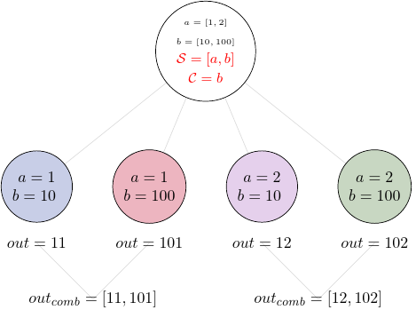
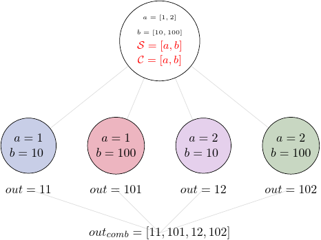

Grouping Task's Output
=======================

In addition to the splitting the input, *Pydra* supports grouping
or combining the output resulting from the splits.
In order to achieve this for a *Task*, a user can specify a *combiner*.
This can be set by calling ``combine`` method.
Note, the *combiner* only makes sense when a *splitter* is
set first. When *combiner=x*, all values are combined together within one list,
and each element of the list represents an output of the *Task* for the specific
value of the input *x*. Splitting and combining for this example can be written
as follows:

.. math::

   S = x &:& ~x=[x_1, x_2, ..., x_n] \mapsto x=x_1, x=x_2, ..., x=x_n, \\
   C = x &:& ~out(x_1), ...,out(x_n) \mapsto out_{comb}=[out(x_1), ...out(x_n)],

where `S` represents the *splitter*, *C* represents the *combiner*, :math:`x` is the input field,
:math:`out(x_i)` represents the output of the *Task* for :math:`x_i`, and :math:`out_{comb}`
is the final output after applying the *combiner*.

In the situation where input has multiple fields and an *outer splitter* is used,
there are various ways of combining the output.
Taking as an example the task from the previous section,
user might want to combine all the outputs for one specific value of :math:`x_i` and
all the values of :math:`y`.
In this situation, the combined output would be a two dimensional list, each
inner list for each value of :math:`x`. This can be written as follow:

.. math::

    C = y &:& ~out(x_1, y1), out(x_1, y2), ...out(x_n, y_m) \\
    &\longmapsto& ~[[out(x_1, y_1), ..., out(x_1, y_m)], \\
    && ~..., \\
    && ~[out(x_n, y_1), ..., out(x_n, y_m)]].

However, for the same task the user might want to combine
all values of :math:`x` for specific values of :math:`y`.
One may also need to combine all the values together.
This can be achieved by providing a list of fields, :math:`[x, y]` to the combiner.
When a full combiner is set, i.e. all the fields from
the splitter are also in the combiner, the output is a one dimensional list:

.. math::

   C = [x, y] : out(x_1, y1), ...out(x_n, y_m) \longmapsto [out(x_1, y_1), ..., out(x_n, y_m)].

These are the basic examples of the *Pydra*'s *splitter-combiner* concept. It
is important to note, that *Pydra* allows for mixing *splitters* and *combiners*
on various levels of a dataflow. They can be set on a single *Task* or a *Workflow*.
They can be passed from one *Task* to following *Tasks* within the *Workflow*.
